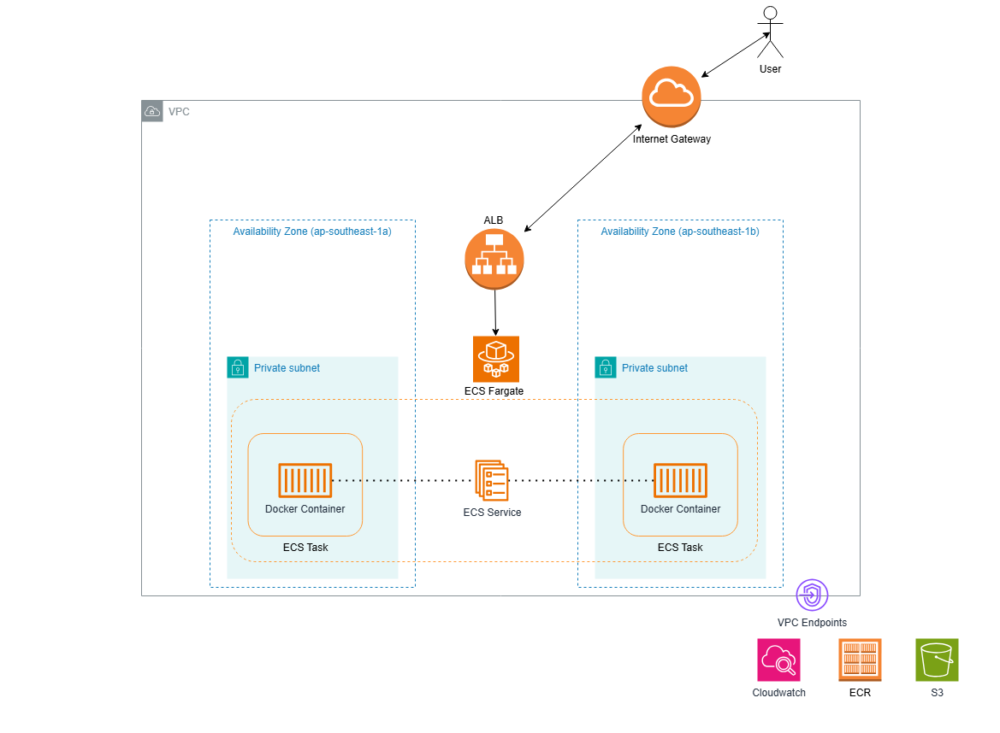

# Node.js CI/CD Pipeline Assessment

A comprehensive Node.js application with automated CI/CD pipelines deployed to AWS infrastructure using Terraform.

## 🚀 Overview

This project demonstrates enterprise-grade DevOps practices with:
- **Dual Environment Setup**: Development (EC2) and Production (ECS Fargate)
- **4 Distinct CI/CD Pipelines**: Automated and manual deployment workflows
- **Infrastructure as Code**: Complete AWS infrastructure managed with Terraform
- **Comprehensive Testing**: Unit tests, integration tests, and code quality checks
- **Container Orchestration**: Docker containerization with Amazon ECR

## 📋 Table of Contents

- [Application Architecture](#application-architecture)
- [Infrastructure Overview](#infrastructure-overview)
- [CI/CD Pipelines](#cicd-pipelines)
- [Testing Strategy](#testing-strategy)
- [Terraform Infrastructure](#terraform-infrastructure)
- [Deployment Process](#deployment-process)
- [Getting Started](#getting-started)
- [Monitoring & Observability](#monitoring--observability)

## 🏗️ Application Architecture

### Development Environment
- **Compute**: Amazon EC2 instance
- **Networking**: AWS Default VPC with public subnet
- **Container Registry**: Amazon ECR
- **Deployment**: Direct application deployment via AWS Systems Manager

.png)

### Production Environment  
- **Compute**: Amazon ECS Fargate (single task, cost-optimized)
- **Networking**: Custom VPC with public/private subnets across multiple AZs
- **Load Balancing**: Application Load Balancer in public subnets
- **Container Placement**: ECS tasks in private subnets (no direct internet access)
- **Container Registry**: Amazon ECR
- **VPC Endpoints**: ECR, Docker, S3, CloudWatch (cost optimization)
- **High Availability**: ECS Service maintains desired task count with ALB health checks



## 🔄 CI/CD Pipelines

### 1. Development CI/CD Pipeline (`dev-cicd.yml`)
**Trigger**: Push to `dev` branch

**Workflow**:
1. **Code Quality**: Run linting checks (ESLint)
2. **Testing**: Execute unit and integration tests
3. **Build**: Create Docker image
4. **Push**: Upload to Amazon ECR
5. **Deploy**: Deploy to EC2 instance via AWS Systems Manager

**Purpose**: Rapid development iteration with automated deployment to development environment.

### 2. Production Application Deployment (`prod-deploy.yml`)
**Trigger**: Push to `main` branch

**Workflow**:
1. **Code Quality**: Run linting checks (ESLint)
2. **Testing**: Execute unit and integration tests
3. **Build**: Create production Docker image
4. **Push**: Upload to Amazon ECR with `:latest` tag
5. **Deploy**: Trigger ECS service update with zero-downtime deployment

**Purpose**: Automated production deployment with quality gates.

### 3. Production Infrastructure Management (`prod-infrastructure.yml`)
**Trigger**: Manual (workflow_dispatch)

**Parameters**:
- `action`: Choice between `plan` or `apply`

**Workflow**:
1. **Setup**: Configure AWS credentials and Terraform
2. **Plan**: Always show planned infrastructure changes
3. **Apply**: Conditionally apply changes (only if `apply` selected)

**Purpose**: Safe infrastructure management with human approval for production changes.

### 4. Pull Request Validation (`pr-validation.yml`)
**Trigger**: Pull request to `main` branch

**Workflow**:
1. **Linting**: Code quality validation
2. **Unit Tests**: Fast feedback on code changes
3. **Integration Tests**: End-to-end functionality validation
4. **Build Validation**: Ensure Docker image builds successfully

**Purpose**: Quality gate to prevent broken code from reaching production.

## 🧪 Testing Strategy

### Test Types

#### Unit Tests
- **Framework**: Jest
- **Coverage**: Individual functions and modules
- **Location**: `tests/unit.test.js`
- **Focus**: HTML generation logic, core functionality

#### Integration Tests  
- **Framework**: Jest with HTTP testing
- **Coverage**: API endpoints and request/response flow
- **Location**: `tests/integration.test.js`
- **Focus**: Express server functionality, route handling

#### Code Quality
- **Tool**: ESLint
- **Configuration**: `eslint.config.js`
- **Enforcement**: Integrated into all CI/CD pipelines
- **Standards**: JavaScript best practices and consistency

### Testing in CI/CD

**Development Pipeline**:
- Runs all tests before deployment
- Blocks deployment on test failures
- Fast feedback for development iterations

**Production Pipeline**:
- Comprehensive test suite execution
- Quality gate before production deployment
- Zero-downtime deployment only after successful tests

**PR Validation**:
- Full test suite on every pull request
- Prevents merging of broken code
- Automated quality assurance

## 🏗️ Terraform Infrastructure

### Module Structure

#### Networking Module (`infra/modules/networking/`)
**Resources**:
- VPC with custom CIDR
- Public and private subnets across multiple AZs
- Internet Gateway and NAT Gateway
- VPC Endpoints (ECR, S3, CloudWatch)
- Security Groups

**Purpose**: Provides secure, scalable network foundation for prod environment.

#### Compute Module (`infra/modules/compute/`)

**EC2 Submodule** (`compute/ec2/`):
- EC2 instance for development environment
- Security groups for SSH and HTTP access
- User data script for application setup
- Systems Manager integration

**ECS Submodule** (`compute/ecs/`):
- ECS Cluster for container orchestration
- ECS Service with Fargate launch type
- Application Load Balancer
- Health monitoring and automatic task replacement
- CloudWatch integration

### Environment-Specific Configurations

#### Development (`infra/dev/`)
- Smaller instance sizes
- Single AZ deployment
- Development-specific variable values
- Cost-optimized configuration

#### Production (`infra/prod/`)
- Production-grade instance sizes
- Multi-AZ deployment for high availability
- Production security configurations
- Performance-optimized settings

### State Management
- **Backend**: S3 with DynamoDB locking
- **Isolation**: Separate state files per environment
- **Security**: Encrypted state storage

## 🚀 Deployment Process

### Development Deployment
1. **Developer** pushes code to `dev` branch
2. **GitHub Actions** automatically triggers development pipeline
3. **Quality Checks** run (linting, tests)
4. **Docker Image** built and pushed to ECR
5. **EC2 Deployment** via AWS Systems Manager
6. **Application** available at development URL

### Production Deployment
1. **Developer** creates pull request from `dev` to `main`
2. **PR Validation** pipeline runs automatically
3. **Code Review** and approval process
4. **Merge** to `main` branch triggers production pipeline
5. **Quality Gates** execute (comprehensive testing)
6. **Production Deployment** to ECS Fargate
7. **Zero-Downtime** rolling update
8. **Application** available at production URL

### Infrastructure Updates
1. **Infrastructure Engineer** modifies Terraform code
2. **Manual Trigger** of infrastructure pipeline with `plan` action
3. **Review** planned changes
4. **Manual Trigger** with `apply` action to implement changes
5. **Infrastructure** updated with zero service disruption

## 🏁 Getting Started

### Prerequisites
- AWS Account with appropriate permissions
- GitHub repository with secrets configured
- Docker installed locally
- Node.js 18+ for local development

### AWS Secrets Configuration
Add these secrets to your GitHub repo:
```
AWS_ACCESS_KEY_ID: Your AWS access key
AWS_SECRET_ACCESS_KEY: Your AWS secret key
```

### Local Development
```bash
# Clone repository
git clone https://github.com/yourusername/node-hello.git
cd node-hello

# Install dependencies
npm install

# Run tests
npm test

# Run linting
npm run lint

# Start development server
npm start
```

### Infrastructure Deployment
```bash
# Initialize Terraform
cd infra/prod
terraform init

# Plan infrastructure changes
terraform plan

# Apply infrastructure
terraform apply
```

## 📊 Monitoring & Observability

### CloudWatch Integration
- **Container Logs**: Centralized logging for ECS tasks
- **Application Metrics**: Custom metrics from the application
- **Infrastructure Metrics**: ECS resource utilization
- **Alarms**: Automated alerting for critical issues

### Health Checks
- **Application**: Built-in health check endpoint
- **Load Balancer**: Target group health checks
- **ECS**: Container health monitoring and automatic replacement

### Logging Strategy
- **Structured Logging**: JSON format for better parsing
- **Log Levels**: Appropriate logging levels (info, warn, error)
- **Retention**: Configurable log retention policies
- **Searchability**: CloudWatch Insights for log analysis

## 🔒 Security Considerations

### Network Security
- Private subnets for ECS tasks
- Security groups with minimal required access
- VPC endpoints to avoid internet routing
- NAT Gateway for secure outbound access

### Container Security
- Minimal base images
- Regular image updates
- ECR image scanning
- Non-root container execution

### Access Control
- IAM roles with least privilege
- Service-linked roles for ECS
- Temporary credentials in CI/CD
- Encrypted data in transit and at rest

## 📈 Performance Considerations

### High Availability & Reliability
- Application Load Balancer for traffic distribution across AZs
- ECS service with automatic task replacement
- CloudWatch monitoring for operational visibility

### Cost Optimization
- VPC endpoints to reduce NAT Gateway costs
- Single task deployment for demonstration purposes
- Right-sized instances for development (free tier t2.micro for ec2 instances)
- VPC endpoints instead of NAT Gateway for ECR access


### Monitoring Commands
```bash
# Check ECS service status
aws ecs describe-services --cluster production --services node-hello-service

# View container logs
aws logs get-log-events --log-group-name /ecs/node-hello

# Check load balancer targets
aws elbv2 describe-target-health --target-group-arn <target-group-arn>
```

